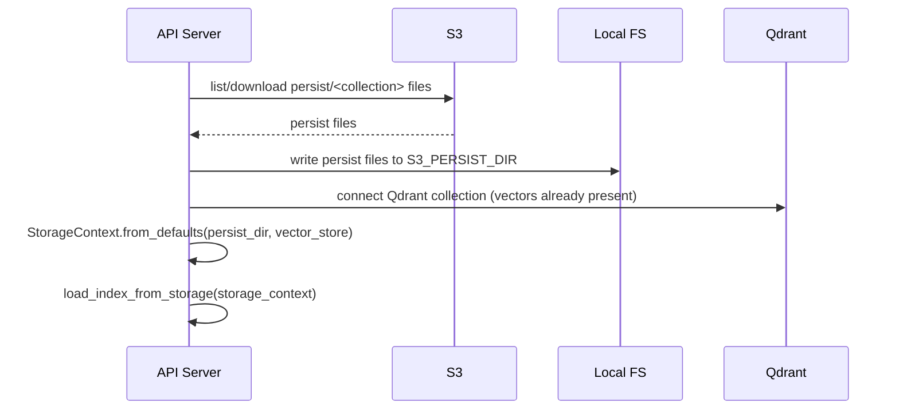
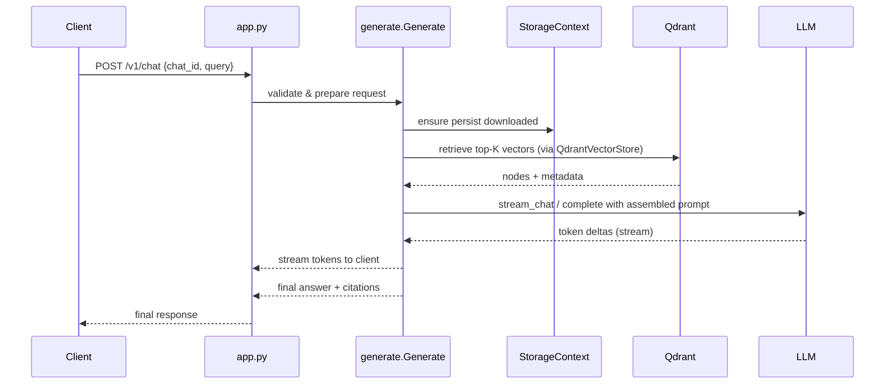

# Developer Guide — RAG API (Aeronation)

This document explains the architecture, setup, and workflows for the RAG API project so a new developer can get productive quickly.

## Table of Contents
- [Project overview](#project-overview)
- [Architecture & components](#architecture--components)
- [Key files and directories](#key-files-and-directories)
- [Local development setup](#local-development-setup)
- [Configuration and secrets](#configuration-and-secrets)
- [Data ingestion (create_persist.py)](#data-ingestion-scriptscreate_persistpy)
- [Persistence model and S3](#persistence-model-and-s3)
- [Running the API locally](#running-the-api-locally)
- [Testing & smoke checks](#testing--smoke-checks)
- [Troubleshooting common issues](#troubleshooting-common-issues)
- [Extending the system (LLMs, embeddings, vector stores)](#extending-the-system-llms-embeddings-vector-stores)
- [Deployment notes](#deployment-notes)
- [Useful commands & scripts](#useful-commands--scripts)
- [Detailed technical reference (components & flows)](#detailed-technical-reference-components--flows)
- [Diagrams: ingestion, persist, and query flows](#diagrams-ingestion-persist-and-query-flows)
- [Important classes & functions (concise)](#important-classes--functions-concise)
- [Final notes](#final-notes)

---

## Project overview

This repository hosts a Retrieval-Augmented Generation (RAG) API that:

- Ingests local PDF documents, turns them into chunks and embeddings, and stores them in a Qdrant vector store via LlamaIndex.
- Persists LlamaIndex storage artifacts under `persist/<collection>` and uploads them to S3 so the API can download them at runtime.
- Exposes a FastAPI endpoint `/v1/chat` which accepts a `chat_id`, `query`, and `category`, loads the persisted index (download from S3 if needed), queries the vector store, and streams an LLM-generated response.

Core technologies:
- Python 3.10+ (project uses a virtualenv in `venv/`)
- FastAPI + Uvicorn
- LlamaIndex (indexing, StorageContext, query engine)
- Qdrant (vector store)
- HuggingFace embeddings (SentenceTransformers via `llama-index-embeddings-huggingface`)
- AWS S3 for persist storage + Secrets Manager for credentials

---

## Architecture & components

- `app.py` — FastAPI application and lifecycle. Loads config and secrets, initializes logging and LLM, defines `/v1/chat` endpoint. Uses `generate.Generate` to process requests.
- `generate.py` — Core RAG orchestration: storage manager (S3), model manager (embed and LLM), StorageContext setup, Qdrant integration and query engine initialization, streaming generation and postprocessing.
- `scripts/create_persist.py` — Ingestion script: reads PDFs from a `data/` directory, splits text, builds LlamaIndex nodes, inserts them into a QdrantVectorStore, persists `persist/<collection>`, and uploads files to S3.
- `secrets_manager.py` — Helper to fetch credentials from AWS Secrets Manager (project expects a secret name in `config/config.yaml`).
- `config/config.yaml` — Runtime configuration (S3 buckets, model names, RAG params, PDF base url, Qdrant flags).
- `prompts/` — Prompt templates used by the greeting classifier, QA, citation templates, etc.

---

## Key files and directories

- `app.py` — entrypoint for the API
- `generate.py` — main RAG logic
- `scripts/create_persist.py` — ingestion and upload script
- `data/` — local PDFs (source documents). By convention, the ingestion script expects PDFs here or in a sibling `data/` directory.
- `persist/` — local persistence folder (created by ingestion); the app downloads from S3 into a configured `S3_PERSIST_DIR` before loading.
- `config/config.yaml` — central configuration (S3 buckets, HF embed model, LLM settings)
- `prompts/*.prompt` — prompt text used by LLM flows
- `requirements.txt` — Python dependencies

---

## Local development setup

1. Clone repository and open in VS Code.
2. Create a virtualenv (Windows example):

```powershell
python -m venv venv
.\venv\Scripts\Activate.ps1
pip install -r requirements.txt
```

3. Ensure `data/` contains PDFs you want to index (example: `data/iso27001.pdf`).
4. Configure `config/config.yaml` for your environment. Important keys:
   - `S3_PERSIST_BUCKET` — bucket used to upload/download persisted index
   - `S3_PERSIST_DIR` — local base dir used when downloading persist files
   - `HF_EMBED` — HuggingFace embedding model name
   - `LLM_MODEL_TYPE` and related model config blocks
   - `QDRANT_ENABLE_HYBRID`, `FASTEMBED_SPARSE_MODEL` — Qdrant hybrid config

5. Ensure AWS credentials and other API keys are available via AWS Secrets Manager or environment variables. The project expects a secret id (e.g. `aeronation/rag/test/api-keys`) stored in `config/config.yaml` under `SECRETS_MANAGER`. `secrets_manager.get_secret(config)` will fetch it.

---

## Configuration and secrets

- The app relies on AWS Secrets Manager to store keys (OpenAI/Groq, Qdrant URL & API key, AWS keys). The helper `secrets_manager.py` loads the secret JSON and returns a dict.
- If the local helper isn't available or returns None, scripts fall back to trying a direct boto3 call or environment variables.
- Keys expected in the secret JSON (example):
  - `QDRANT_URL`, `QDRANT_API_KEY`
  - `AWS_ACCESS_KEY_ID`, `AWS_SECRET_ACCESS_KEY`
  - `OPENAI_API_KEY`, `GROQ_API_KEY`, `ANTHROPIC_API_KEY`, `COHERE_API_KEY`, `TAVILY_API_KEY` (depending on LLMs used)

Security note: prefer storing secrets in Secrets Manager and granting least-privilege IAM roles to the running environment.

---

## Data ingestion (`scripts/create_persist.py`)

Purpose: Read PDFs, chunk text, embed, insert into Qdrant via LlamaIndex `VectorStoreIndex`, then persist the `StorageContext` to `persist/<collection>` and upload files to S3.

Typical run:

```powershell
python scripts/create_persist.py --data-dir ./data --collection rag_llm \
  --qdrant-url https://<qdrant-host> --qdrant-api-key <key>
```

Behavior and notes:
- The script tries to find `--data-dir` in multiple locations (literal path, project-root relative, sibling `data/`).
- It uses a minimal PDF reader (pypdf / PyPDF2 required). If you get reader import errors, install `pypdf` or `PyPDF2` in the venv.
- Embedding model is loaded via `HuggingFaceEmbedding` (SentenceTransformer). This can be slow on first load; avoid running the script on machines without enough memory/GPU.
- After building nodes, the script inserts them into `VectorStoreIndex` with a QdrantVectorStore backing. The Qdrant collection is created or detected by the `QdrantVectorStore` wrapper.
- The `StorageContext.persist()` call writes index and docstore files to `persist/<collection>`. These files are then uploaded to S3 under the prefix `persist/<collection>/`.

If ingestion is successful, the S3 bucket will contain the persisted LlamaIndex files and the API can download them using the configured `S3_PERSIST_BUCKET` and `S3_PERSIST_DIR`.

---

## Persistence model and S3

- LlamaIndex `StorageContext.persist()` writes multiple files: docstore, index store, graph store, and namespaced vector store files.
- The app's `StorageManager.load_persist_dir()` expects the S3 prefix `persist/<collection>` to contain those files. It downloads them into `S3_PERSIST_DIR/persist/<collection>/` and then `StorageContext.from_defaults(persist_dir=that_local_path, vector_store=QdrantVectorStore(...))` is used to load the index.
- Important: For Qdrant-backed indices, the vector data lives in Qdrant. The persisted files primarily include index store and docstore metadata. Ensure Qdrant collection exists and contains the vectors (ingestion script stores vectors into Qdrant during ingestion).

---

## Running the API locally

Start the FastAPI server (development):

```powershell
uvicorn app:app --host 0.0.0.0 --port 8000 --reload
```

## Running RAG evals

The offline evaluator in `evals/` scores answer correctness, groundedness,
context recall, citation coverage, and available latency/token telemetry from
JSONL cases and predictions. It does not call external services, so it is
suitable for local regression checks:

```powershell
python scripts/run_evals.py --predictions evals/predictions.jsonl
```

Use `evals/dataset.jsonl` as the schema reference when adding cases. Predictions
can include `latency_ms`, `stage_latencies_ms`, `time_to_first_token_ms`,
`generation_duration_ms`, `input_tokens_estimate`, `output_tokens_estimate`,
`total_tokens_estimate`, `output_tokens_per_second`, `token_chunks`,
`average_inter_chunk_ms`, and `max_inter_chunk_ms`. Case-level limits such as
`max_latency_ms`, `max_time_to_first_token_ms`, `max_total_tokens`, and
`min_output_tokens_per_second` turn those signals into pass/fail checks.

A live
runner can call `EvaluationCase` with its generated `Prediction`; for semantic
scoring, pass the configured LlamaIndex LLM to
`evaluate_case_with_llm_judge`. The judge expects JSON scores for correctness,
groundedness, and relevance and is intentionally opt-in because it consumes
provider quota.

Example request (JSON body):

```json
{
  "chat_id": "test",
  "query": "What is ISO 27001?",
  "category": "oil_gas"
}
```

Call with curl:

```bash
curl -X POST http://localhost:8000/v1/chat -H "Content-Type: application/json" -d @body.json
```

Notes:
- `app.py` initializes the LLM adapter based on `LLM_MODEL_TYPE` in config. If you get `openai.NotFoundError` or model-not-found errors, double-check model names and access permissions.
- On first load the app downloads `persist/<collection>` from S3 into the local `S3_PERSIST_DIR`. Ensure the IAM credentials used have `s3:GetObject` rights for that bucket/prefix.

---

## Testing & smoke checks

- Verify S3 files exist after ingestion: list objects under `persist/<collection>/` using aws cli or a small script.
- Check Qdrant collection: use `qdrant_client` to query `collection.exists` or list collections.
- Test the classifier and LLM flows individually by importing `app` and calling `llm.complete()` with prompt templates.

Example quick validation script (interactive):

```python
from generate import ModelManager, StorageManager, Generate
from config.config import config  # if you keep a config module; else load YAML
# instantiate and call Generate with a small query to ensure retrieval works
```

---

## Troubleshooting common issues

- Missing `pypdf`/`PyPDF2`: ingestion fails to read PDFs. Install via `pip install pypdf`.
- `ValueError: QDRANT_URL not found`: set `QDRANT_URL`/`QDRANT_API_KEY` via Secrets Manager, env vars, or pass `--qdrant-url`/`--qdrant-api-key` to the ingestion script.
- S3 `AccessDenied`: ensure `AWS_ACCESS_KEY_ID` / `AWS_SECRET_ACCESS_KEY` used by the script or role have permissions for the bucket and prefix.
- LlamaIndex `No index in storage context`: means persist files were not uploaded to S3 or the local path passed to `StorageContext.from_defaults()` doesn't contain the right files.
- Greeting classifier returns True unexpectedly: open `prompts/greeting_classifier.prompt` and adjust the wording or temporarily bypass the classifier for debugging.

---

## Extending the system

- Add new LLM adapters: `generate.ModelManager._load_llm_model()` shows how adapters are wired. Follow the pattern and add to `config/config.yaml`.
- Switch embeddings: change `HF_EMBED` in config. If model is large, ensure the host has enough memory/GPU.
- Add new vector stores: LlamaIndex supports alternative vector store adapters; add analogous code to `generate._setup_storage_context()`.

---

## Deployment notes

- For production, run the API behind a process manager (systemd, supervisor) or containerize with Docker and use an orchestration platform.
- Avoid storing long-lived secrets directly in config files. Use Secrets Manager and retrieve them at runtime.
- Ensure Qdrant is reachable from the runtime environment and that the collection is persisted (vectors are in Qdrant and metadata in S3).

---

## Useful commands & scripts

- Ingest documents and upload persistence to S3:
  - `python scripts/create_persist.py --data-dir ./data --collection rag_llm --qdrant-url <url> --qdrant-api-key <key>`
- Start API (dev): `uvicorn app:app --reload --host 0.0.0.0 --port 8000`
- Verify S3 objects (quick script): `python scripts/check_s3.py` (if present)
- Run tests or quick plays by importing `generate.Generate` from a Python REPL and calling `.generate_answer()` on a prepared instance.

---

## Contacts & next steps

- If you hit secrets / AWS issues, confirm you can `aws s3 ls s3://<S3_PERSIST_BUCKET>/persist/` from the host and that Secrets Manager has the expected JSON structure.
- If the LLM model errors occur, verify API keys and model availability for your account/provider.

This file should give a new developer a reliable path to reproduce ingestion, verify persistence, and run the API. If you want, I can also add a `docs/DEVELOPER_CHECKLIST.md` with a condensed step-by-step onboarding checklist and a `docker-compose` file to simplify local integration testing.

---

## Detailed technical reference (components & flows)

This section dives into implementation details developers will want to understand before changing core behavior.

### 1) Greeting classifier

- Location: `app.py` and used in `generate.Generate.generate_answer()`.
- Purpose: detect short queries that are conversational greetings ("hi", "hello", "how are you?") and route them to a lightweight greeting flow instead of invoking RAG retrieval and long-form LLM generation.
- Implementation: the classifier is a prompt template stored in `prompts/greeting_classifier.prompt`. The code executes:

```python
is_greeting = llm.complete(prompts.greeting_classifier.format(query=query)).text.strip()
if is_greeting == "True":
    # run greeting flow
```

- Behavior notes:
  - The classifier is itself an LLM call — so false positives/negatives depend on prompt wording and LLM behavior.
  - The classifier expects an exact string `"True"` from the LLM to indicate a greeting. Modify prompt or check logic to change sensitivity.
  - Greeting flow uses `llm.stream_chat()` to stream a friendly short response rather than RAG.

### 2) Model management (`ModelManager`)

- Location: `generate.py` (class `ModelManager`).
- Responsibilities:
  - Lazily construct and cache embedding model (`HuggingFaceEmbedding`) and the LLM adapter (`OpenAI`, `Ollama`, `Anthropic`, or `Groq`).
  - Respect retry/backoff via `tenacity` when loading LLMs.
- Important details:
  - `Settings.llm` and `Settings.embed_model` are set globally before query engine construction so downstream LlamaIndex components resolve the models correctly.
  - Embedding initialization (`HuggingFaceEmbedding`) can be slow and memory intensive; avoid re-initializing for each request.

### 3) Storage and persistence (`StorageManager`)

- Location: `generate.py` (`StorageManager`).
- Responsibilities:
  - Download persisted LlamaIndex files from S3 into the local `S3_PERSIST_DIR` when needed.
  - Cache the local persist path per `persist_dir/collection` to avoid repeated downloads.
  - Manage chat history retrieval and saving to S3 (separate `S3_LOGS_BUCKET`).

- Key behavior:
  - `load_persist_dir(persist_dir, collection)` lists S3 objects under `<persist_dir>/<collection>` and downloads them exactly as uploaded by the ingestion script.
  - If S3 returns no `Contents`, the method raises ValueError to indicate missing persistence.

### 4) Qdrant integration and `StorageContext` setup

- Location: `generate._setup_storage_context()` in `generate.py`.
- Steps performed:
  1. Create `qdrant_client.QdrantClient` and `AsyncQdrantClient` using secrets.
  2. Instantiate `QdrantVectorStore(...)` with collection name and client objects.
  3. Call `StorageContext.from_defaults(persist_dir=self._persist, vector_store=vector_store)` to create a storage context that references the persisted doc/index stores and the qdrant vector store.
  4. Call `load_index_from_storage(storage_context)` which loads index structs from index store and instantiates LlamaIndex index objects.

- Important notes:
  - Vector data (embeddings) lives in Qdrant; the persisted files store index & document metadata.
  - The `QdrantVectorStore` wrapper auto-detects vector format and collection existence; ingestion must have stored points in Qdrant.

### 5) Query flow (end-to-end)

High-level steps executed per request (`/v1/chat` -> `Generate`):

1. Input validated by Pydantic `RAG` model (app-level validators also call the greeting classifier in `app.py` for quick rejection).
2. `Generate` sets `Settings.llm` and `Settings.embed_model` from `ModelManager`.
3. Chat history is loaded via `StorageManager.load_chat_history(chat_id)` and injected into the refined query.
4. The script ensures the persisted files are available locally by calling `StorageManager.load_persist_dir(persist_dir, collection)`.
5. `_setup_storage_context()` constructs `StorageContext` connected to Qdrant and loads the index with `load_index_from_storage()`.
6. The `CitationQueryEngine` is constructed with:
   - `embed_model` (for optional re-embedding)
   - `llm` instance for citation-level generation and streaming
   - Node postprocessors like `CohereRerank` and `SimilarityPostprocessor`
   - Templates for citation/QA and refine prompts
7. The engine retrieves top-K nodes for the (refined) query.
8. If no adequate context is found (scores under the cutoff), the system falls back to Tavily search and builds a prompt for the LLM.
9. Otherwise the engine calls the index/query pipeline to generate an answer — streaming tokens are yielded via `query_engine.query(...).response_gen`.
10. Postprocessing produces:
    - A streaming series of tokens (`type: tokens`),
    - A final `answer` object containing assembled text,
    - A `context` object with citations (file name, page, chunk), and
    - `related` queries and possibly a generated conversation title.

### 6) Context, citations & metadata

- Each node returned from retrieval carries `metadata` (file_name, page_num, highlighted_chunk). The code maps those metadata fields into citation links using `PDF_BASE_URL`.
- The `_process_contexts()` method in `generate.py` locates citation markers like `[1]` and replaces them with markdown links to the original PDF URL using the `file_name` metadata.
- Metadata filtering: `Generate._prepare_metadata_filters()` turns user-supplied metadata into `MetadataFilter` objects which are supplied to the query engine for filtered retrieval.

### 7) Streaming behavior and tokenization

- Streaming is driven by the LLM wrapper adapter `llm.stream_chat()` which yields small `delta` pieces; the API rewraps these into JSON messages with `type: tokens`.
- The greeting flow also streams via `stream_chat()` but is typically much shorter.
- The ingestion and generation flows respect `RAG_STREAMING` config flag to enable/disable streaming.

### 8) Error handling & logging

- Errors in S3/Qdrant/LLM initialization are logged at appropriate levels (error/critical) and often re-raised to produce API 500 responses.
- The app configures CloudWatch logging via `LogManager.setup_logging()` if available; otherwise local logging is used.

### 9) Extension & customization points

- To change greeting logic change `prompts/greeting_classifier.prompt` or replace the classifier call with a deterministic regex.
- To add a new LLM provider, extend `ModelManager._load_llm_model()` and add a block for configuration in `config.yaml`.
- To change chunking behavior edit the ingestion `chunk_text()` in `scripts/create_persist.py` or replace with a semantic splitter (e.g., `RecursiveCharacterTextSplitter` style).

---

## Final notes

This expanded section should give developers deeper insight into the runtime flow and where to make changes. If you want, I will:

- add sequence diagrams (Mermaid) showing ingestion -> persist -> query flows,
- create a `docs/DEVELOPER_CHECKLIST.md` with explicit step-by-step onboarding commands,
- or produce small runnable tests that exercise each subsystem (S3 download, Qdrant query, LLM streaming) in `scripts/tests/`.

Tell me which of the 3 you'd like next and I will add it.

---

## Diagrams: ingestion, persist, and query flows

Below are compact Mermaid diagrams that illustrate the main runtime flows. You can paste these into a Markdown renderer that supports Mermaid (VS Code Markdown Preview or GitHub with Mermaids enabled in an extension).

### Ingestion flow (high-level)

```mermaid
flowchart LR
  A[Local PDFs (data/)] --> B[scripts/create_persist.py]
  B --> C{Chunk & Embed}
  C --> D[Qdrant Vector Store (points)]
  C --> E[LlamaIndex Nodes]
  E --> F[StorageContext.persist() -> persist/<collection> files]
  F --> G[S3: persist/<collection>/ (uploaded files)]
  style A fill:#f9f,stroke:#333,stroke-width:1px
  style G fill:#efe,stroke:#333,stroke-width:1px
```

### Persist & application startup



### Query flow (request -> streaming response)



---

## Important classes & functions (concise)

This section lists key classes and functions with a short description and where to find them in the codebase.

- `Generate` (class) — [generate.py](generate.py):
  - Orchestrates request handling: validates input, loads chat history, ensures persistence, constructs the query engine, runs retrieval, streams LLM responses, and postprocesses citations.

- `Generate.generate_answer()` — [generate.py](generate.py):
  - Main entry: accepts request payloads and returns an async generator or final answer. Handles greeting routing, query refinement, retrieval, and streaming semantics.

- `ModelManager` (class) — [generate.py](generate.py):
  - Builds and caches embedding and LLM adapter instances. Handles provider-specific wiring (Groq, OpenAI, Anthropic, Ollama) and retry logic.

- `ModelManager._load_llm_model()` — [generate.py](generate.py):
  - Provider switch: reads `Settings` / config and constructs the correct LLM wrapper.

- `StorageManager` (class) — [generate.py](generate.py):
  - S3 helpers: download/upload persist artifacts, cache local persist paths, and manage chat logs.

- `StorageManager.load_persist_dir()` — [generate.py](generate.py):
  - Lists S3 prefix `persist/<collection>` and downloads objects to local `S3_PERSIST_DIR`. Raises `ValueError` if no files present.

- `QdrantVectorStore` (adapter) — via `llama_index.vector_stores.qdrant` (see [generate.py](generate.py) usage):
  - LlamaIndex adapter that forwards vector operations to `qdrant_client`. Ingestion must insert points; the adapter uses the existing collection and vector schema.

- `_setup_storage_context()` — [generate.py](generate.py):
  - Creates `QdrantClient` instances, wraps them in `QdrantVectorStore`, calls `StorageContext.from_defaults()` and `load_index_from_storage()` to produce index/query objects.

- `scripts/create_persist.py` (module):
  - `main()` / `ingest()` — reads PDFs from `data/`, splits into chunks, creates LlamaIndex nodes, inserts into `VectorStoreIndex` with `QdrantVectorStore` backing, calls `StorageContext.persist()` to write local files, and uploads those files to S3.
  - `chunk_text()` / `split_pages()` — text processing utilities used by ingestion to create node-sized chunks.

- `secrets_manager.get_secret()` — [secrets_manager.py](secrets_manager.py):
  - Returns a dict of credentials from AWS Secrets Manager. The ingestion script and `app.py` use this to find `QDRANT_URL`, `QDRANT_API_KEY`, and provider API keys.

- `prompts/*.prompt` files: (see [prompts/](prompts/) for templates)
  - Prompt templates used for greeting classification, citation templates, QA prompt, and refinement prompts. Adjusting these changes behavior without code edits.

---

If you'd like, I can also:

- render alternative, more detailed sequence diagrams (lifelines per class) for maintainers,
- add inline anchor links to these class descriptions so readers can quickly jump to the corresponding file sections.

Which would you prefer next? 


