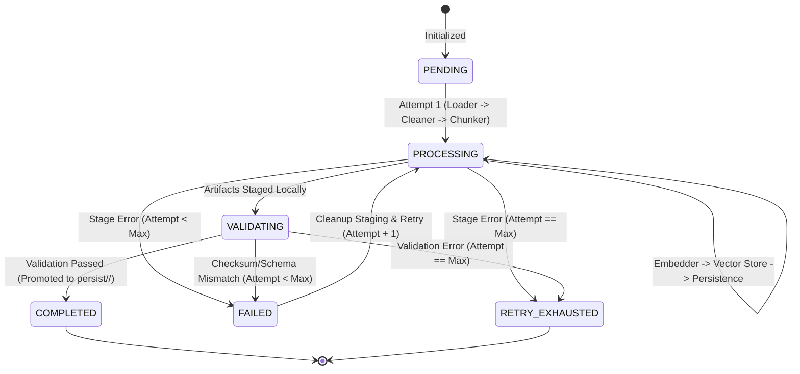
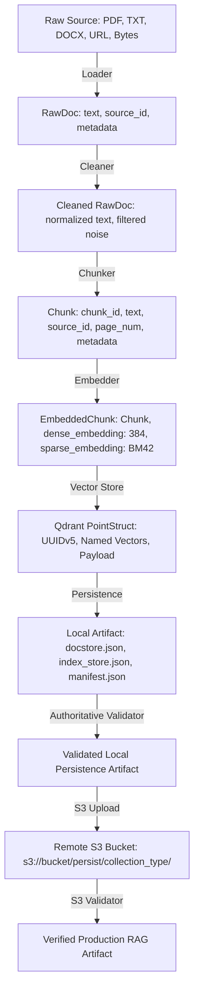

# Technical Specification & Schema: Data Ingestion Pipeline

**Repository:** Aeronation RAG API (`rag-api`)  
**Scope:** Data Ingestion Pipeline (Standardized Implementation for Issue #9)  
**Document Version:** 1.0.0  
**Target Audience:** Core Engineers, ML Engineers, DevOps, API Consumers  

---

## Table of Contents

1. [Overview](#1-overview)
2. [High-Level Architecture](#2-high-level-architecture)
3. [System Pipeline](#3-system-pipeline)
4. [User Pipeline](#4-user-pipeline)
5. [Stage-by-Stage Data Flow & Models](#5-stage-by-stage-data-flow--models)
6. [Stage 1: Loader](#6-stage-1-loader)
7. [Stage 2: Cleaner](#7-stage-2-cleaner)
8. [Stage 3: Chunker](#8-stage-3-chunker)
9. [Stage 4: Embedder (Hybrid Dense + Sparse)](#9-stage-4-embedder-hybrid-dense--sparse)
10. [Stage 5: Vector Store / Qdrant](#10-stage-5-vector-store--qdrant)
11. [Stage 6: Persistence Layer](#11-stage-6-persistence-layer)
12. [Stage 7: Manifest & Versioning](#12-stage-7-manifest--versioning)
13. [Stage 8: Authoritative Validation Layer](#13-stage-8-authoritative-validation-layer)
14. [Stage 9: S3 Upload & Remote Verification](#14-stage-9-s3-upload--remote-verification)
15. [Configuration & Environment Matrix](#15-configuration--environment-matrix)
16. [Error Handling & Failure Taxonomies](#16-error-handling--failure-taxonomies)
17. [Pipeline Telemetry & Stage Counts](#17-pipeline-telemetry--stage-counts)
18. [Pipeline Invariants](#18-pipeline-invariants)
19. [Acceptance Criteria Mapping (Issue #9)](#19-acceptance-criteria-mapping-issue-9)
20. [Known Limitations & Integration Boundaries](#20-known-limitations--integration-boundaries)

---

## 1. Overview

The Aeronation RAG Ingestion Pipeline standardizes the transformation of raw operational, technical, and compliance documents into indexed, hybrid-searchable vector representations in **Qdrant** while simultaneously maintaining 100% backward compatibility with on-disk **LlamaIndex** persistence artifacts (`persist/<collection_type>/`) and remote **Amazon S3** backups.

### Core Objectives
1. **Hybrid Retrieval Indexing**: Generates paired dense embeddings (sentence-transformers via FastEmbed ONNX) and sparse BM42 lexical weights for lexical-semantic fusion.
2. **Dual Pipeline Execution**: Provides two specialized entry points:
   - **System Pipeline**: Bounded re-ingestion retry loop, durable state tracking, idempotent crash recovery for batch corpora and scheduled triggers.
   - **User Pipeline**: Synchronous, fast-failing single-request ingestion isolated in an ephemeral workspace with guaranteed cleanup.
3. **Zero Silent Loss**: Every valid document page and chunk is accounted for. Any failure during embedding, vector upsert, or persistence immediately triggers failure reporting without dropping points.
4. **LlamaIndex Storage Compatibility**: Preserves all standard LlamaIndex index and docstore JSON files (`docstore.json`, `index_store.json`, `graph_store.json`, `image__vector_store.json`) allowing the `/v1/chat` generation engine to load indices directly without re-embedding.
5. **Authoritative Read-Only Validation**: Guarantees configuration sanity, schema integrity, checksum consistency, dimension matching, and S3 artifact presence before promoting artifacts to production.

---

## 2. High-Level Architecture

The ingestion subsystem consists of shared stage processors (`loader`, `cleaner`, `chunker`, `embedder`, `vector_store`, `persistence`, `s3_upload`), an authoritative validation layer (`validator`), and two orchestration drivers (`system_pipeline`, `user_pipeline`).

```
====================================================================================================
                                AERONATION RAG INGESTION SUBSYSTEM
====================================================================================================

               +-------------------------------------------------------------+
               |                       TRIGGER / INPUT                       |
               +-------------------------------------------------------------+
                              |                               |
                              | Batch/Cron/CLI                | HTTP/User Request
                              v                               v
             +----------------------------------+   +----------------------------------+
             |         SYSTEM PIPELINE          |   |          USER PIPELINE           |
             | (Bounded Retries, State Tracking,|   | (Synchronous, Ephemeral Work-    |
             |  Idempotent Staging Cleanup)     |   |  space, Fast-Fail, Zero Retries) |
             +----------------------------------+   +----------------------------------+
                              |                               |
                              +---------------+---------------+
                                              |
                                              v
                              +-------------------------------+
                              |           1. LOADER           |
                              | PDF / TXT / MD / DOCX / HTML  |
                              +-------------------------------+
                                              |
                                              v RawDoc (Page-Level Granularity)
                              +-------------------------------+
                              |          2. CLEANER           |
                              | Normalization & Filter Noise  |
                              +-------------------------------+
                                              |
                                              v Cleaned RawDoc
                              +-------------------------------+
                              |          3. CHUNKER           |
                              | Paragraph + Sentence Packing  |
                              +-------------------------------+
                                              |
                                              v Chunk (Deterministic IDs)
                              +-------------------------------+
                              |          4. EMBEDDER          |
                              |  FastEmbed Dense + BM42 Sparse|
                              +-------------------------------+
                                              |
                                              v EmbeddedChunk (Dense 384 + Sparse)
                              +-------------------------------+
                              |     5. VECTOR STORE / QDRANT  |
                              | Hybrid Named Vectors & Payload|
                              +-------------------------------+
                                              |
                                              v VectorStoreResult
                              +-------------------------------+
                              |     6. PERSISTENCE LAYER      |
                              | LlamaIndex Storage + Manifest |
                              +-------------------------------+
                                              |
                                              v Persisted Artifact
                              +-------------------------------+
                              |    7. AUTHORITATIVE VALIDATOR |
                              | Checksums, Counts, Dimensions |
                              +-------------------------------+
                                              |
                     +------------------------+------------------------+
                     | Validated Artifact                              |
                     v                                                 v
   +------------------------------------+            +------------------------------------+
   |          8. S3 UPLOADER            |            |       PROMOTED LOCAL PERSIST       |
   | Atomic Staging -> Production Prefix|            |      persist/<collection_type>/    |
   +------------------------------------+            +------------------------------------+
                     |                                                 |
                     v                                                 v
   +------------------------------------+            +------------------------------------+
   |         9. S3 VALIDATOR            |            |       RAG API /v1/chat ENGINE      |
   | Remote Manifest & Object Checks    |            |      (LlamaIndex StorageContext)   |
   +------------------------------------+            +------------------------------------+
```

---

## 3. System Pipeline

**Primary Module:** `rag-api/ingestion/shared_processing/system_pipeline.py` (Exposed via `rag-api/ingestion/orchestration/system_pipeline.py`)

### Execution Characteristics
- **Execution Mode:** Long-running, asynchronous batch processing or administrative CLI invocations (`main()`).
- **Input Types:** Directory path (`data_dir`), batch URL list (`urls`), or pre-loaded `RawDoc` list.
- **Bounded Re-Ingestion Retry Policy:**
  - Configured via `MAX_REINGESTION_ATTEMPTS` or `MAX_RETRIES` (default: 3).
  - Attempt sequence: Attempt 1 (Initial), Attempt 2 (Retry 1), Attempt 3 (Retry 2).
  - Hard upper bound: When attempts reach `max_attempts` without successful completion, execution terminates and marks durable status as `RETRY_EXHAUSTED`.
- **Durable State Tracking:** Maintains `IngestionState` persisted to `persist/<collection_type>/ingestion_state.json` across attempts.
- **Atomic Crash Recovery:** Before re-attempting a failed execution, `cleanup_staging_artifacts()` deletes temporary on-disk staging artifacts (`persist/.tmp/<collection_type>_<ingestion_id>/`) to prevent leftover corrupted files from polluting the workspace.
- **Production Isolation:** If an ingestion attempt fails at any stage, the existing production collection under `persist/<collection_type>/` is never overwritten. Promotion only occurs upon 100% stage validation.

### System Pipeline State Machine



---

## 4. User Pipeline

**Primary Module:** `rag-api/ingestion/shared_processing/user_pipeline.py` (Exposed via `rag-api/ingestion/orchestration/user_pipeline.py`)

### Execution Characteristics
- **Execution Mode:** Synchronous, low-latency, single-user/request ingestion for API endpoints.
- **Input Types:** Raw bytes (uploaded file stream), single local file path, single URL, list of URLs, or in-memory `RawDoc` instances.
- **Ephemeral Workspace Isolation:** Creates an isolated temporary directory via Python `tempfile.TemporaryDirectory(prefix="user_ingestion_")`. All intermediate parsing, chunking, and staged persistence files reside exclusively within this workspace.
- **Zero Retries / Fail-Fast:** System-level retry loops are disabled. Any failure immediately aborts execution and returns a structured `UserPipelineResult` indicating the exact failed stage and error message.
- **Guaranteed Cleanup:** The `TemporaryDirectory` context manager guarantees deletion of intermediate files upon success, failure, or uncaught exception.
- **Target Promotion:** Upon full validation, if `persist_artifact=True` (default), the validated persistence files are copied to `persist/<collection_type>/`.
- **Optional S3 Upload:** S3 upload is disabled by default (`upload_to_s3=False`) for user requests to ensure sub-second response times, but can be enabled on demand.

---

## 5. Stage-by-Stage Data Flow & Models

The data pipeline passes strongly typed dataclasses between stages. The data structures are defined in `rag-api/models.py`.



### Data Contract Table

| Stage | Input Type | Output Type | Primary Output Fields / Payload |
|---|---|---|---|
| **1. Loader** | `Path`, `str` (URL), `bytes` | `list[RawDoc]` | `text`, `source_id`, `metadata={"file_name", "page_num", "page_count", "source_format", "extraction_status", "is_empty"}` |
| **2. Cleaner** | `list[RawDoc]` | `list[RawDoc]` | Cleaned `text` (whitespace collapsed, line-breaks un-hyphenated, control chars stripped), preserved `source_id` & `metadata` |
| **3. Chunker** | `list[RawDoc]` | `list[Chunk]` | `chunk_id` (`chunk-{sha256[:16]}`), `text`, `source_id`, `page_num`, `metadata={"chunk_id", "chunk_index", "total_chunks", "char_count", "content_hash"}` |
| **4. Embedder** | `list[Chunk]` | `EmbeddingResult` -> `list[EmbeddedChunk]` | `chunk: Chunk`, `dense_embedding: list[float]` (384-dim), `sparse_embedding: SparseEmbeddingData(indices, values)` |
| **5. Vector Store** | `list[EmbeddedChunk]` | `VectorStoreResult` -> Qdrant Points | `id` (UUIDv5), `vector={"text-dense": [...], "text-sparse-new": {...}}`, `payload={"text", "source_id", "chunk_id", "page_num", ...}` |
| **6. Persistence** | `list[EmbeddedChunk]` + Configs | `PersistenceResult` | `persist/<collection_type>/` containing `docstore.json`, `index_store.json`, `graph_store.json`, `image__vector_store.json`, `manifest.json`, `ingestion_state.json` |
| **7. Validator** | On-disk / Remote artifacts | `ValidationResult` | `valid: bool`, `stage: str`, `errors: list[str]`, `warnings: list[str]`, `checks_performed: int` |
| **8. S3 Upload** | Local directory | `S3UploadResult` | `bucket`, `prefix`, `files_uploaded`, `bytes_uploaded`, `uploaded_keys`, `manifest_key`, `success: bool` |

---

## 6. Stage 1: Loader

**Primary Module:** `rag-api/ingestion/shared_processing/loader.py`

### Capabilities & Specifications
- **Supported File Formats:** `.pdf`, `.txt`, `.md`, `.png`, `.jpg`, `.jpeg`, `.docx`, and HTTP(S) Web URLs.
- **Explicitly Rejected Formats:** `.doc` (recommends conversion to `.docx`/`.pdf`), `.ppt`/`.pptx` (unsupported), `.html` local files (recommends URL loading or `.txt`).
- **Page-Level Granularity:** PDF documents are extracted on a strict per-page basis (`page_num` starting at 1). This is required for citation rendering (`[[1]](url#page=N)`). Non-paged sources (docx, text, webpages, single images) are represented as single logical pages (`page_num=1`, `page_count=1`).
- **PDF Scanned-Page OCR Fallback:** Pages with fewer than 20 characters (`_OCR_MIN_CHARS = 20`) trigger automatic OCR via `pdf2image` and `pytesseract` (when system dependencies are installed).
- **Stable Source ID:** Derived deterministically via `stable_source_id(identifier)`:
  $$\text{source\_id} = \text{slugify}(\text{stem}) + \text{"-"} + \text{SHA256}(\text{identifier})[:8]$$
  *Example:* `"data/flight_manual.pdf"` $\rightarrow$ `"flight-manual-a3b8c91d"`.
- **Strict vs. Non-Strict Modes:**
  - `strict=False` (System batch): Logs parsing/permission failures and continues processing remaining corpus files.
  - `strict=True` (User request): Raises typed `LoaderError` immediately to inform the client.
- **Deliberate Non-Responsibilities:** The Loader does *not* perform tokenization, NLP normalization, chunking, or vector operations.

---

## 7. Stage 2: Cleaner

**Primary Module:** `rag-api/ingestion/shared_processing/cleaner.py`

### Text Normalization Pipeline
1. **Line Ending Normalization:** Unifies `\r\n` (Windows) and `\r` (Legacy Mac) into Unix newlines `\n`.
2. **Control Character Stripping:** Removes all Unicode category `Cc` characters while preserving tabs (`\t`), newlines (`\n`), mathematical symbols, Greek characters, degree symbols ($^\circ$), and superscripts/subscripts.
3. **Line-Break Hyphenation Repair:** Matches `(?<=[a-zA-Z])-[ \t]*\n[ \t]*(?=[a-z])` to rejoin split words (e.g., `"aero-\ndynamic"` $\rightarrow$ `"aerodynamic"`) without modifying hyphenated compounds (e.g., `"state-of-the-art\nmodel"`).
4. **Whitespace Normalization:** Collapses consecutive horizontal spaces and tabs into single spaces; collapses multiple blank lines so distinct paragraphs are separated by exactly `\n\n`.
5. **Empty Document Pruning:** Documents containing only whitespace or noise after cleaning return `None` and increment `counts.docs_discarded`.

---

## 8. Stage 3: Chunker

**Primary Module:** `rag-api/ingestion/shared_processing/chunker.py`

### 5-Step Chunking Strategy
```
Raw Cleaned Text
       ↓
[Step 1: Paragraph Split] ---> Splits text on double newlines (\n\s*\n+)
       ↓
[Step 2: Sentence Split]  ---> Oversized paragraphs split on sentence boundaries: (?<=[.!?…])\s+(?=[A-Z0-9"“'(\[])
       ↓
[Step 3: Word Slicing]    ---> Unbroken strings larger than chunk_size split on whitespace
       ↓
[Step 4: Greedy Budget]   ---> Packs atomic units into chunk_size (default: 512)
       ↓
[Step 5: Natural Overlap] ---> Next chunk begins by backtracking up to chunk_overlap (default: 64)
```

- **Deterministic Chunk IDs:** `generate_chunk_id(text)` generates content-addressable IDs:
  $$\text{chunk\_id} = \text{"chunk-"} + \text{SHA256}(\text{text.strip()})[:16]$$
- **Metadata Propagation:** Chunks retain all document metadata and append:
  - `chunk_id`: Deterministic hash.
  - `chunk_index`: 1-based sequential position within the document.
  - `total_chunks`: Total chunks generated from the document.
  - `char_count`: Exact string length of the chunk text.
  - `content_hash`: Full 64-character SHA-256 hash.

---

## 9. Stage 4: Embedder (Hybrid Dense + Sparse)

**Primary Module:** `rag-api/ingestion/shared_processing/embedder.py`

### Architecture & Models
The embedder powers Qdrant hybrid retrieval by computing two complementary vector representations:

```
                                +-------------------------+
                                |       Input Chunk       |
                                +-------------------------+
                                             |
                     +-----------------------+-----------------------+
                     |                                               |
                     v                                               v
   +------------------------------------+          +------------------------------------+
   |          DENSE EMBEDDING           |          |          SPARSE EMBEDDING          |
   | Model: sentence-transformers/      |          | Model: Qdrant/bm42-all-minilm-     |
   |        all-MiniLM-L6-v2            |          |        l6-v2-attentions            |
   | Engine: FastEmbed (ONNX Runtime)   |          | Engine: FastEmbed SparseText       |
   | Output: 384-dimensional float list |          | Output: BM42 token indices + values|
   +------------------------------------+          +------------------------------------+
                     |                                               |
                     +-----------------------+-----------------------+
                                             |
                                             v
                               +---------------------------+
                               |       EmbeddedChunk       |
                               +---------------------------+
```

### Specifications
- **Dense Embedding Model:** `sentence-transformers/all-MiniLM-L6-v2` (Configurable via `HF_EMBED`, default dimension: 384).
- **Sparse Embedding Model:** `Qdrant/bm42-all-minilm-l6-v2-attentions` (Configurable via `FASTEMBED_SPARSE_MODEL`).
- **Batch Processing:** Configurable batch size via `EMBEDDING_BATCH_SIZE` (default: 32/64).
- **Cache Management:** Models are cached in `.fastembed_cache` at the project root to prevent re-downloading.
- **Zero Silent Loss Guarantee:** If any chunk within a batch fails embedding generation:
  - In `strict=True` mode: Raises `EmbedderError` immediately.
  - In `strict=False` mode: Collects `FailedChunk` objects; downstream stages reject the run if `len(failed_chunks) > 0`.
- **Dimension Validation:** Validates `len(dense_vector) == expected_dimension` before outputting.

---

## 10. Stage 5: Vector Store / Qdrant

**Primary Module:** `rag-api/ingestion/shared_processing/vector_store.py`

### Qdrant Collection Schema

```json
{
  "vectors": {
    "text-dense": {
      "size": 384,
      "distance": "Cosine"
    }
  },
  "sparse_vectors": {
    "text-sparse-new": {}
  }
}
```

### Critical Invariants & Rules
1. **Dimension Invariant:**
   $$\text{EMBEDDING\_DIMENSION (384)} \equiv \text{QDRANT\_COLLECTION\_DIMENSION (384)}$$
2. **Deterministic Point IDs:** Generated via UUIDv5 bound to the chunk namespace:
   $$\text{point\_id} = \text{UUIDv5}(\text{NAMESPACE\_URL}, \text{"urn:chunk:"} + \text{chunk\_id})$$
3. **Non-Destructive Safety:** `create_collection()` checks if the collection already exists. If present, it validates schema compatibility (dense dimension, distance metric, sparse vector availability). Existing collections are never dropped or recreated automatically.
4. **Payload Schema:** Every point stores:
   - `text`: Cleaned chunk text.
   - `source_id`: Stable source document identifier.
   - `chunk_id`: Deterministic chunk hash.
   - `page_num`: Page number for citation rendering.
   - `metadata`: Complete original dictionary (including `file_name`, `page_count`, etc.).

---

## 11. Stage 6: Persistence Layer

**Primary Module:** `rag-api/ingestion/shared_processing/persistence.py`

### Directory Structure: `persist/<collection_type>/`
The persistence format strictly maintains compatibility with LlamaIndex `StorageContext`:

```
persist/
└── <collection_type>/                   # e.g., rag_llm/ or aerospace_manuals/
    ├── docstore.json                   # LlamaIndex document store registry
    ├── index_store.json                # LlamaIndex vector index struct mapping
    ├── graph_store.json                # Graph store placeholder structure
    ├── image__vector_store.json        # Image vector store placeholder
    ├── manifest.json                   # Version-bound manifest with SHA-256 checksums
    └── ingestion_state.json            # Durable lifecycle state tracker (System pipeline)
```

### Re-Loading Without Embedding Regeneration
The RAG API server (`rag-api/generate.py`) loads existing collections in `O(1)` time without re-computing embeddings:

```python
vector_store = QdrantVectorStore(
    client=qdrant_client,
    collection_name="rag_llm",
    enable_hybrid=True,
)
storage_context = StorageContext.from_defaults(
    persist_dir="persist/rag_llm",
    vector_store=vector_store,
)
index = load_index_from_storage(storage_context)
```

- Vectors remain stored in Qdrant.
- Structural metadata and node mappings are loaded from `docstore.json` and `index_store.json`.

---

## 12. Stage 7: Manifest & Versioning

**Primary Module:** `rag-api/ingestion/shared_processing/persistence.py` (`build_manifest`)

### `manifest.json` Schema Specification

```json
{
  "schema_version": "1.0.0",
  "collection_type": "rag_llm",
  "ingestion_id": "rag_llm_20260819T060511Z_d74aec0e",
  "version": "rag_llm_20260819T060511Z_d74aec0e",
  "status": "COMPLETED",
  "attempt": 1,
  "max_attempts": 3,
  "failed_stage": null,
  "error": null,
  "qdrant": {
    "collection_name": "rag_llm",
    "dense_vector_name": "text-dense",
    "sparse_vector_name": "text-sparse-new",
    "dimension": 384,
    "distance": "Cosine",
    "enable_hybrid": true
  },
  "embedding": {
    "dense_model": "sentence-transformers/all-MiniLM-L6-v2",
    "sparse_model": "Qdrant/bm42-all-minilm-l6-v2-attentions",
    "dimension": 384
  },
  "chunking": {
    "chunk_size": 512,
    "chunk_overlap": 64,
    "min_chunk_size": 0
  },
  "counts": {
    "files_seen": 1,
    "docs_loaded": 1,
    "docs_cleaned": 1,
    "docs_discarded": 0,
    "chunks_created": 1,
    "embeddings_generated": 1,
    "chunks_failed": 0,
    "vectors_inserted": 1,
    "vectors_failed": 0
  },
  "persistence": {
    "format": "llamaindex",
    "files": [
      "docstore.json",
      "graph_store.json",
      "image__vector_store.json",
      "index_store.json",
      "manifest.json"
    ],
    "checksums": {
      "docstore.json": "sha256:44136fa355b3678a1146ad16f7e8649e94fb4fc21fe77e8310c060f61caaff8a",
      "graph_store.json": "sha256:1062066bc85452d028723e03eb2b1e55dd2d8284da4c7cba1f19c4d7b6eb6f72",
      "image__vector_store.json": "sha256:d17ed74c1649a438e518a8dc56a7772913dfe1ea7a7605bce069c63872431455",
      "index_store.json": "sha256:c68cd016bc78fcac4c33a41436670ffdf509c84a4bc0a767e84fdaf14e06bc1f",
      "manifest.json": "sha256:05f43fef0f7dfd86b9663bdb397cc6ad7c85b02fd64f948a207919ac5ac8184e"
    }
  },
  "created_at": "2026-08-19T06:06:43.399084+00:00",
  "updated_at": "2026-08-19T06:06:43.421550+00:00"
}
```

### Purpose of Versioning
- **Collision Prevention**: Every ingestion attempt generates a timestamped identifier `generate_ingestion_id(collection_type)`.
- **Integrity Validation**: The manifest records the exact SHA-256 hashes of all on-disk files.
- **Zero Secrets Enforcement**: Manifest generation validates that no API keys or AWS credentials are ever serialized.

---

## 13. Stage 8: Authoritative Validation Layer

**Primary Module:** `rag-api/validator.py`

`validator.py` is the single authoritative, strictly read-only validation module in the codebase. It performs no disk writes, no Qdrant mutations, and no S3 uploads.

### Authoritative Validation Rules Matrix

| Function | Validation Scope & Assertions |
|---|---|
| `validate_collection_type()` | Rejects path traversal (`..`), slashes (`/`, `\`), enforces regex `^[a-zA-Z0-9_-]+$`. |
| `validate_config()` | Validates positive `chunk_size`, `chunk_overlap < chunk_size`, positive dimensions, valid distance metrics (`Cosine`, `Dot`, `Euclid`, `Manhattan`), and non-empty model names. |
| `validate_documents()` | Verifies non-empty list, `isinstance(doc, RawDoc)`, non-empty text, valid `source_id`, and dictionary metadata. |
| `validate_cleaned_documents()`| Ensures cleaner did not discard 100% of input documents without explicit `allow_empty=True`. |
| `validate_chunks()` | Checks `chunk_id` non-empty and unique, non-empty chunk text, valid `source_id`, token limits. |
| `validate_embeddings()` | Enforces Zero Silent Loss (`len(chunks) == len(embedded)`), zero `failed_chunks`, dense dimension equality, and sparse `(indices, values)` numeric and length consistency. |
| `validate_vector_store()` | Verifies collection exists in Qdrant, dense vector dimension match, distance metric match, and sparse vector configuration. |
| `validate_manifest()` | Validates top-level schema keys, version/collection_type binding, and persistence checksum table. |
| `validate_persistence()` | Ensures all required LlamaIndex files exist, recomputes and matches SHA-256 checksums against manifest, and tests roundtrip `StorageContext` loading. |
| `validate_counts()` | Enforces logical count invariants: $\text{docs\_cleaned} \le \text{docs\_loaded}$, $\text{chunks\_created} == \text{embeddings\_generated} == \text{vectors\_inserted}$, and $\text{chunks\_failed} == 0$. |
| `validate_s3_artifact()` | Validates that remote S3 objects exist via `head_object` and matches remote manifest versioning. |
| `validate_ingestion_result()` | High-level validator executing count and persistence validations before final promotion. |

> [!NOTE]
> **Module Status:** `rag-api/validator.py` is the single authoritative module. Any legacy references to `validation.py` have been consolidated into `validator.py` with backward compatibility shims (`validate_local_artifact`, `validate_persisted_artifact`).

---

## 14. Stage 9: S3 Upload & Remote Verification

**Primary Module:** `rag-api/ingestion/shared_processing/s3_upload.py`

### Remote S3 Hierarchy
```
s3://<S3_PERSIST_BUCKET>/
└── <S3_PERSIST_PREFIX>/                       # default: "persist"
    └── <collection_type>/                     # e.g., "rag_llm"
        ├── .tmp/<ingestion_id>/               # Staging prefix (when S3_ENABLE_STAGING=True)
        │   ├── docstore.json
        │   └── ...
        ├── docstore.json                      # Production S3 artifacts
        ├── index_store.json
        ├── graph_store.json
        ├── image__vector_store.json
        └── manifest.json
```

### Staging, Atomic Promotion & Verification Workflow
1. **Pre-Upload Validation:** Calls `validator.validate_local_artifact(persist_dir)` to verify checksums and manifest integrity before touching S3.
2. **Staged Upload:** Uploads all files to temporary prefix `persist/<collection>/.tmp/<ingestion_id>/`.
3. **Partial Failure Abort:** If any file fails upload, `cleanup_staged_s3_artifact()` deletes the partial upload and raises `S3UploadError`.
4. **Staging Verification:** Calls `verify_s3_objects()` on staged keys.
5. **Atomic S3 Promotion:** Copies staged objects to production keys `persist/<collection>/<filename>` using `s3_client.copy_object`.
6. **Production Verification:** Verifies production keys and fetches `manifest.json` from S3.
7. **Staging Cleanup:** Deletes temporary staging objects in S3.

---

## 15. Configuration & Environment Matrix

Configuration parameters are managed by dataclasses in `models.py` and read with fallback hierarchy: **Explicit Arguments $\rightarrow$ Environment Variables $\rightarrow$ `config/config.yaml` Defaults**.

| Environment Variable | Config YAML Key | Default Value | Description |
|---|---|---|---|
| `QDRANT_URL` | `QDRANT_URL` | `None` (Required in Prod) | Remote Qdrant cluster endpoint |
| `QDRANT_API_KEY` | `QDRANT_API_KEY` | `None` | Qdrant authentication token |
| `QDRANT_COLLECTION` | `collection_name` | `rag_llm` | Target Qdrant collection name |
| `VECTOR_DIMENSION` / `EMBEDDING_DIMENSION` | `VECTOR_DIMENSION` | `384` | Dense vector dimension |
| `VECTOR_DISTANCE` | `VECTOR_DISTANCE` | `Cosine` | Qdrant distance metric (`Cosine`, `Dot`, `Euclid`) |
| `QDRANT_ENABLE_HYBRID` | `QDRANT_ENABLE_HYBRID` | `True` | Enables dense + sparse hybrid vector collection |
| `DENSE_VECTOR_NAME` | `DENSE_VECTOR_NAME` | `text-dense` | Name of dense vector in Qdrant points |
| `SPARSE_VECTOR_NAME` | `SPARSE_VECTOR_NAME` | `text-sparse-new` | Name of sparse vector in Qdrant points |
| `HF_EMBED` / `EMBEDDING_MODEL` | `HF_EMBED` | `sentence-transformers/all-MiniLM-L6-v2` | Dense embedding model name |
| `FASTEMBED_SPARSE_MODEL` | `FASTEMBED_SPARSE_MODEL` | `Qdrant/bm42-all-minilm-l6-v2-attentions` | Sparse embedding model name |
| `FASTEMBED_CACHE_DIR` | `FASTEMBED_CACHE_DIR` | `./.fastembed_cache` | Local FastEmbed model storage directory |
| `EMBEDDING_BATCH_SIZE` | `EMBEDDING_BATCH_SIZE` | `32` / `64` | Embedding batch processing size |
| `RAG_CHUNK_SIZE` / `CHUNK_SIZE` | `RAG_CHUNK_SIZE` | `512` | Token / character chunk target size |
| `RAG_CHUNK_OVERLAP` / `CHUNK_OVERLAP` | `RAG_CHUNK_OVERLAP` | `64` | Overlap character size between chunks |
| `RAG_MIN_CHUNK_SIZE` | `RAG_MIN_CHUNK_SIZE` | `0` | Minimum chunk size threshold |
| `PERSIST_DIR` | `S3_PERSIST_DIR` | `persist` | Local persistence directory |
| `PERSIST_COLLECTION_TYPE` | `COLLECTION_TYPE` | `rag_llm` | Target collection category name |
| `MAX_REINGESTION_ATTEMPTS` / `MAX_RETRIES` | `MAX_RETRIES` | `3` | Maximum retry attempts in System pipeline |
| `S3_PERSIST_BUCKET` / `S3_BUCKET` | `S3_PERSIST_BUCKET` | `""` | AWS S3 bucket for index persistence |
| `S3_PERSIST_PREFIX` / `PERSIST_PREFIX` | `S3_PERSIST_PREFIX` | `persist` | Base prefix in S3 bucket |
| `AWS_REGION` | `AWS_REGION` | `ap-south-1` | AWS region name |
| `S3_ENABLE_STAGING` | `S3_ENABLE_STAGING` | `True` | Enable atomic staging prefix in S3 |

---

## 16. Error Handling & Failure Taxonomies

All exceptions inherit from `PipelineError` in `rag-api/errors.py`.

```
PipelineError (Base)
├── SourceError / LoaderError (Stage: Loader)
│   ├── SourceNotFoundError
│   ├── SourcePermissionError
│   ├── UnsupportedFormatError
│   ├── EmptySourceError
│   └── ParseError
├── CleanerError (Stage: Cleaner)
├── ChunkerError (Stage: Chunker)
├── EmbedderError (Stage: Embedder)
│   ├── ModelLoadError
│   └── DimensionMismatchError
├── VectorStoreError (Stage: Vector Store)
│   ├── CollectionNotFoundError
│   ├── IncompatibleCollectionError
│   └── VectorDimensionError
├── PersistenceError (Stage: Persistence)
│   ├── ManifestError
│   └── IncompleteArtifactError
├── ValidationError (Stage: Validator)
├── S3Error (Stage: S3 Upload)
│   ├── S3ConfigurationError
│   ├── S3UploadError
│   ├── S3VerificationError
│   ├── S3PermissionError
│   └── S3ObjectNotFoundError
└── PipelineExecutionError (Stage: Orchestration)
    ├── StageExecutionError
    └── RetryExhaustedError
```

### Stage Error Ownership Table

| Failure Scenario | Responsible Stage | Raised Error Class |
|---|---|---|
| Invalid collection type (e.g. `../bad_path`) | Init / Validation | `ValueError` / `ValidationError` |
| Source file not found or URL unreachable | Loader | `SourceNotFoundError` |
| File unreadable / HTTP 403 Forbidden | Loader | `SourcePermissionError` |
| Unsupported extension (e.g. `.ppt`) | Loader | `UnsupportedFormatError` |
| Empty file or 0 extracted pages | Loader | `EmptySourceError` |
| PDF/Image parsing or OCR failure | Loader | `ParseError` |
| Cleaner discarded all documents | Cleaner | `CleanerError` |
| Chunker produced 0 chunks | Chunker | `ChunkerError` |
| Embedding model failed to download | Embedder | `ModelLoadError` |
| Dense embedding dimension mismatch | Embedder | `DimensionMismatchError` |
| Qdrant collection missing | Vector Store | `CollectionNotFoundError` |
| Qdrant vector size/metric incompatible | Vector Store | `IncompatibleCollectionError` |
| Qdrant network failure during upsert | Vector Store | `VectorStoreError` |
| Manifest JSON corruption or generation error | Persistence | `ManifestError` |
| Missing persistence file (`docstore.json`) | Persistence | `IncompleteArtifactError` |
| Checksum mismatch between disk & manifest | Persistence / Validator | `IncompleteArtifactError` / `ValidationError` |
| S3 bucket missing in configuration | S3 Upload | `S3ConfigurationError` |
| AWS S3 AccessDenied (HTTP 403) | S3 Upload | `S3PermissionError` |
| S3 partial upload network failure | S3 Upload | `S3UploadError` |
| Remote S3 object missing post-upload | S3 Upload / Validator | `S3ObjectNotFoundError` / `S3VerificationError` |
| System pipeline retry budget exhausted | Orchestrator | `RetryExhaustedError` |

---

## 17. Pipeline Telemetry & Stage Counts

Telemetry is tracked via `StageCounts` (`models.py`) and recorded in `manifest.json`:

```python
@dataclass
class StageCounts:
    files_seen: int = 0            # Total files discovered in input source
    docs_loaded: int = 0           # Total document pages successfully parsed
    docs_cleaned: int = 0          # Document pages surviving text cleaning
    docs_discarded: int = 0        # Empty/whitespace-only document pages pruned
    chunks_created: int = 0        # Total text chunks packed by chunker
    embeddings_generated: int = 0  # Total chunks with successful dense+sparse embeddings
    chunks_failed: int = 0         # Chunks that failed embedding generation
    vectors_inserted: int = 0      # Vectors successfully upserted into Qdrant
    vectors_failed: int = 0        # Vectors failing Qdrant upsert
```

---

## 18. Pipeline Invariants

The following 10 invariants are strictly enforced:

1. **Document Preservation**: Empty documents must never produce chunks.
2. **Hybrid Pairing**: Every valid chunk must possess both a dense embedding vector and sparse lexical weights when hybrid retrieval is enabled.
3. **Zero Silent Loss**: Chunks or vectors that fail embedding or upsert must never be silently discarded. Any failure marks the execution attempt as failed.
4. **Dimension Equality**: The dense embedding model output dimension must match the Qdrant collection dense vector configuration ($\text{Dimension} \equiv 384$).
5. **Metadata Preservation**: Critical document and page attributes (`source_id`, `page_num`, `file_name`) must remain attached throughout chunking, embedding, and vector upserting.
6. **Persistence Loadability**: Persisted files in `persist/<collection_type>/` must be loadable by LlamaIndex `StorageContext` without re-generating embeddings.
7. **Version & Checksum Binding**: The `manifest.json` must record accurate SHA-256 hashes matching all on-disk files.
8. **Production Collection Safety**: A failed ingestion or retry attempt must never overwrite, delete, or corrupt a previously validated production collection.
9. **Collection Sanitization**: All collection names must be validated against path traversal (`..`, `/`, `\`) before filesystem or S3 access.
10. **Zero Secrets in Artifacts**: Credentials, API keys, and secret keys must never be serialized into manifest files, persistence stores, or log outputs.

---

## 19. Acceptance Criteria Mapping (Issue #9)

| Issue #9 Requirement | Implementing Component & Module | Validation & Unit Tests | Status |
|---|---|---|---|
| **Loader Stage** | `loader.py` (`load_file`, `load_directory`, `load_urls`) | `test_loader.py`, `test_user_pipeline.py` | Verified (Page granularity, OCR fallback, typed errors) |
| **Cleaner Stage** | `cleaner.py` (`clean_document`, `clean_text`) | `test_cleaner.py` (12 tests) | Verified (Whitespace, hyphenation, control chars) |
| **Chunker Stage** | `chunker.py` (`chunk_document`, `pack_chunks_with_overlap`) | `test_chunker.py` (16 tests) | Verified (5-step chunking, deterministic IDs) |
| **Embedder Stage** | `embedder.py` (`EmbeddingEngine`, `embed_chunks`) | `test_embedder.py` (18 tests) | Verified (Dense 384 + BM42 sparse, FastEmbed) |
| **Vector Store** | `vector_store.py` (`create_collection`, `upsert_embeddings`) | `test_vector_store.py` (22 tests) | Verified (Hybrid vectors, non-destructive safety, UUIDv5) |
| **Persistence** | `persistence.py` (`persist_collection`, `build_manifest`) | `test_persistence.py` (16 tests) | Verified (LlamaIndex storage files + SHA-256 manifest) |
| **Validator** | `validator.py` (Authoritative read-only layer) | `test_validator.py` (32 tests) | Verified (32 validation checks, read-only guarantees) |
| **S3 Upload** | `s3_upload.py` (`upload_persistence_to_s3`) | `test_s3_upload.py` (20 tests) | Verified (Staging prefix, promotion, verification) |
| **User Pipeline** | `user_pipeline.py` (`run_user_pipeline`) | `test_user_pipeline.py` (23 tests) | Verified (Ephemeral workspace, fast fail, zero retries) |
| **System Pipeline** | `system_pipeline.py` (`run_system_pipeline`) | `test_system_pipeline.py` (8 tests) | Verified (Bounded retries, state recovery, idempotent) |

---

## 20. Known Limitations & Integration Boundaries

1. **Live Qdrant Cloud Testing**: The automated unit test suite operates against in-memory Qdrant (`:memory:`). Live remote Qdrant cluster verification requires `QDRANT_URL` and `QDRANT_API_KEY` configured in the target environment.
2. **AWS S3 Live Credentials**: S3 upload unit tests utilize deterministic mocks. Real S3 uploads require valid AWS IAM credentials (`AWS_ACCESS_KEY_ID`, `AWS_SECRET_ACCESS_KEY`) with `s3:PutObject`, `s3:GetObject`, `s3:ListBucket`, and `s3:DeleteObject` permissions on `S3_PERSIST_BUCKET`.
3. **Optional OCR Binaries**: Full scanned-PDF OCR extraction requires system-level `tesseract-ocr` and `poppler-utils` packages. If absent, the loader logs a warning and marks image-only pages as `extraction_status="empty"` without failing the digital PDF extraction.
4. **Legacy `.doc` Support**: Legacy Word `.doc` files are intentionally rejected with an informative error message; callers must convert them to `.docx` or `.pdf`.
